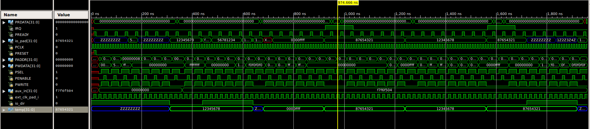

# APB-Based GPIO Core IP

## Overview

This project implements a **32-bit APB-based GPIO Core IP** using Verilog/SystemVerilog RTL.

The design provides an AMBA APB slave interface for software-controlled access to GPIO registers and supports configurable GPIO input, output, and bidirectional operation. The core also includes auxiliary input selection, interrupt generation, programmable input triggering, and external-clock-based GPIO input sampling.

The top-level `gpio_core` integrates four primary functional blocks:

- **APB Slave Interface**
- **GPIO Register**
- **Auxiliary Interface**
- **I/O Interface**

The project includes RTL for the complete core, submodule-level testbenches, a top-level GPIO testbench, simulation waveforms, and a static RTL lint report.

---

## Design Objective

The objective is to design an APB-accessible GPIO IP core that can:

- Receive APB read/write transactions.
- Provide software access to GPIO control and status registers.
- Configure 32 GPIO pins as inputs, outputs, or bidirectional signals.
- Control GPIO output values and output-enable signals.
- Select between normal GPIO data and auxiliary input data.
- Support GPIO interrupt generation.
- Configure programmable input-trigger behavior.
- Support input sampling using either the system clock or an external GPIO clock.
- Support positive- and negative-edge external-clock sampling.
- Expose the GPIO interface through a 32-bit bidirectional `io_pad`.

---

## Top-Level Architecture

The top-level module is:

```text
gpio_core
```

### Top-Level Interface

| Signal | Direction | Width | Description |
|---|---|---:|---|
| `PCLK` | Input | 1 | APB/system clock |
| `PRESET` | Input | 1 | Active-high reset |
| `PADDR` | Input | 32 | APB address |
| `PWDATA` | Input | 32 | APB write data |
| `PSEL` | Input | 1 | APB peripheral select |
| `PENABLE` | Input | 1 | APB enable |
| `PWRITE` | Input | 1 | APB read/write control |
| `PRDATA` | Output | 32 | APB read data |
| `PREADY` | Output | 1 | APB transfer ready |
| `IRQ` | Output | 1 | GPIO interrupt request |
| `aux_in` | Input | 32 | Auxiliary input |
| `io_pad` | Inout | 32 | Bidirectional GPIO pad |
| `ext_clk_pad_i` | Input | 1 | External GPIO clock |

The top-level connects the APB interface to the GPIO register block, while the auxiliary and I/O interfaces provide additional GPIO functionality.

### Architecture

```text
                         +----------------------+
 APB PADDR/PWDATA ------>|                      |
 PSEL/PENABLE/PWRITE --->|  APB SLAVE           |
 PCLK/PRESET ----------->|  INTERFACE           |
                         |                      |
                         +----------+-----------+
                                    |
                         gpio_addr / gpio_we
                         gpio_dat_i / gpio_dat_o
                                    |
                                    v
                         +----------------------+
                         |                      |
 aux_in ---------------->| AUXILIARY INTERFACE |
                         |                      |
                         +----------+-----------+
                                    |
                                    v
                         +----------------------+
                         |                      |
                         |    GPIO REGISTER     |
                         |                      |
                         |  Control Registers   |
                         |  Input/Output Logic  |
                         |  Interrupt Logic     |
                         |  ECLK Sampling      |
                         |                      |
                         +----+------------+----+
                              |            |
                       out_pad_o       oen_padoe_o
                              |            |
                              +-----+------+
                                    |
                                    v
                         +----------------------+
 ext_clk_pad_i --------->|     I/O INTERFACE   |
                         |                      |
                         |   32-bit io_pad     |
                         +----------+-----------+
                                    |
                                    v
                                io_pad[31:0]
```

The supplied design schematic also shows the interconnection of `APB_INTERFACE`, `GPIO_REGISTER`, `AUX_INTERFACE`, and `IO_INTERFACE` inside `gpio_core`.

<p align="center">
  
</p>

<p align="center">
  <b>Figure 1: APB-Based GPIO Core Architecture and Simulation Reference</b>
</p>

---

## 1. APB Slave Interface

The APB slave interface converts APB transactions into internal GPIO register access signals.

### APB State Machine

The implementation uses three states:

```text
IDLE
  |
  | PSEL && !PENABLE
  v
SETUP
  |
  | PSEL && PENABLE
  v
ENABLE
```

The state transitions are implemented according to the APB transfer sequence:

- `IDLE` waits for a selected peripheral transfer.
- `SETUP` represents the APB setup phase.
- `ENABLE` represents the APB access phase.

During an APB write in the `ENABLE` state:

```text
gpio_dat_i = PWDATA
gpio_we    = 1
```

During an APB read in the `ENABLE` state:

```text
gpio_dat_i = 0
gpio_we    = 0
PRDATA     = gpio_dat_o
```

The interface also generates the internal system clock/reset and passes the APB address to the GPIO register block.

---

## 2. GPIO Register Block

The GPIO register block implements the control, data, interrupt, and external-clock configuration registers.

### Register Map

| Register | Address | Width | Function |
|---|---:|---:|---|
| `RGPIO_IN` | `0x00` | 32 | GPIO input/status value |
| `RGPIO_OUT` | `0x04` | 32 | GPIO output data |
| `RGPIO_OE` | `0x08` | 32 | GPIO output-enable control |
| `RGPIO_INTE` | `0x0C` | 32 | GPIO interrupt enable |
| `RGPIO_PTRIG` | `0x10` | 32 | Programmable trigger configuration |
| `RGPIO_AUX` | `0x14` | 32 | Auxiliary input selection |
| `RGPIO_CTRL` | `0x18` | 2 | Interrupt/control bits |
| `RGPIO_INTS` | `0x1C` | 32 | GPIO interrupt status |
| `RGPIO_ECLK` | `0x20` | 32 | External-clock input selection |
| `RGPIO_NEC` | `0x24` | 32 | Negative-edge clock sampling selection |

The RTL defines these addresses directly in `gpio_defines.v`.

---

## 3. GPIO Input and Output Operation

### GPIO Output

`RGPIO_OUT` stores the programmed GPIO output value.

`RGPIO_OE` controls the output-enable state of each GPIO bit.

The output-enable signal is generated as:

```text
oen_padoe_o = rgpio_oe
```

The GPIO output is generated using the programmed output value and auxiliary selection:

```text
out_pad_o = (rgpio_out & ~rgpio_aux) | (aux_i & rgpio_aux)
```

This allows the GPIO output to be selected from either the programmed GPIO output register or the auxiliary input path.

### GPIO Input

The GPIO input is captured into `RGPIO_IN`.

For normal system-clock sampling, the input path uses `in_pad_i`.

For external-clock sampling, the design can use sampled input values captured on the positive or negative edge of `gpio_eclk`.

---

## 4. Bidirectional GPIO Interface

The `io_interface` connects the internal GPIO signals to the external 32-bit bidirectional GPIO pad.

The input path is:

```text
io_pad -> in_pad_i
```

The output path uses tri-state behavior:

```text
oen_padoe_o = 1  -> drive out_pad_o
oen_padoe_o = 0  -> high impedance (Z)
```

The implementation therefore allows individual GPIO pins to operate as externally driven inputs or internally driven outputs.

The design also propagates:

```text
ext_clk_pad_i -> gpio_eclk
```

to provide the external GPIO sampling clock.

---

## 5. Auxiliary Interface

The auxiliary interface provides a registered 32-bit auxiliary input.

On reset:

```text
aux_i = 32'b0
```

Otherwise:

```text
aux_i <= aux_in
```

The registered auxiliary input is subsequently used by the GPIO register block when the corresponding `RGPIO_AUX` bits select the auxiliary path.

---

## 6. Interrupt Functionality

The GPIO register block includes interrupt enable and interrupt status registers.

The main interrupt-related registers are:

- `RGPIO_INTE` — interrupt enable
- `RGPIO_PTRIG` — programmable trigger configuration
- `RGPIO_INTS` — interrupt status
- `RGPIO_CTRL` — interrupt control

The interrupt request is generated from the interrupt-status register:

```text
gpio_inta_o = |rgpio_ints ? rgpio_ctrl[INTE] : 1'b0
```

The top-level APB interface forwards this as:

```text
IRQ = gpio_inta_o
```

The supplied top-level testbench explicitly exercises interrupt-mode operation by enabling interrupts, configuring trigger values, changing GPIO inputs, waiting for `IRQ`, reading the interrupt/input registers, and clearing the interrupt status.

---

## 7. External Clock Input Sampling

The GPIO register block supports sampling GPIO inputs using an external GPIO clock.

Two sampled input registers are implemented:

```text
pextc_sampled
nextc_sampled
```

Positive-edge sampling:

```text
always @(posedge gpio_eclk)
    pextc_sampled <= in_pad_i;
```

Negative-edge sampling:

```text
always @(negedge gpio_eclk)
    nextc_sampled <= in_pad_i;
```

`RGPIO_NEC` selects between the positive- and negative-edge sampled paths.

`RGPIO_ECLK` selects which GPIO input bits use the external-clock sampling path.

The resulting input path is selected through:

```text
in_muxed = (rgpio_eclk & extc_in) |
           (~rgpio_eclk & in_pad_i)
```

This provides configurable per-bit input sampling.

---

## 8. Verification / Simulation

The project contains dedicated testbenches for the major RTL blocks:

```text
tb_apb_slave_interface
tb_gpio_core
tb_gpio_register
tb_aux_interface
tb_io_interface
```

The top-level GPIO testbench generates both the APB/system clock and external clock and exercises multiple GPIO operating modes.

### Top-Level Test Scenarios

The supplied top-level testbench includes:

1. GPIO output operation
2. Polled GPIO input
3. Auxiliary input operation
4. Bidirectional GPIO operation
5. GPIO input in interrupt mode using the system clock
6. GPIO input in polled mode using the external clock
7. GPIO input in interrupt mode using the external clock
8. Bidirectional GPIO operation with external-clock input
9. Programmable trigger configuration
10. Interrupt-status read and clear operations

Representative test patterns include:

```text
0x56781234
0x12345678
0xF7F6F504
0x10203040
0x87654321
0x0000FFFF
0x0000F0F0
0x0F0FF0F0
```

The testbench also explicitly exercises high-impedance GPIO behavior using `Z` values on the bidirectional pad.

---

## 9. RTL Simulation Waveform

The supplied top-level waveform demonstrates activity across the APB interface, GPIO control/data signals, auxiliary path, GPIO pad, and external clock.

Important signals visible in the waveform include:

- `PCLK`
- `PRESET`
- `PSEL`
- `PENABLE`
- `PWRITE`
- `PADDR`
- `PWDATA`
- `PRDATA`
- `PREADY`
- `io_pad`
- `aux_in`
- `ext_clk_pad_i`
- GPIO-related internal signals

The high-resolution waveform supplied with the project is included below.

<p align="center">
  
</p>

<p align="center">
  <b>Figure 2: Top-Level APB GPIO RTL Simulation Waveform</b>
</p>

---

## 10. Static RTL Analysis

The top-level `gpio_core` RTL was analyzed using **VC Static Master Shell**.

### Lint Summary

| Metric | Result |
|---|---:|
| Top-Level Module | `gpio_core` |
| Fatal Errors | **0** |
| Errors | **0** |
| Warnings | **0** |
| Informational Messages | **9** |

The report contains:

- 1 `ReportPortInfo-ML` informational message
- 8 `RegInputOutput-ML` informational messages

The `RegInputOutput-ML` messages identify top-level ports that are not registered, including APB interface inputs/outputs and interrupt/ready signals.

These are reported as **informational messages**, not lint errors or warnings.

### Static Analysis Result

```text
LANGUAGE_CHECK
    Fatals : 0
    Errors : 0
    Warnings : 0
    Infos : 1

STRUCTURAL_CHECK
    Fatals : 0
    Errors : 0
    Warnings : 0
    Infos : 8

TOTAL
    Fatals : 0
    Errors : 0
    Warnings : 0
    Infos : 9
```

The lint report was generated with:

```text
VC Static Master Shell
Version: T-2022.06
Top-Level Module: gpio_core
```

---

## 11. RTL Source Files

The project is organized around the following RTL blocks:

```text
rtl/
├── apb_if.sv
├── apb_slave_interface.v
├── aux_if.sv
├── aux_interface.v
├── gpio_core.v
├── gpio_defines.v
├── gpio_register.v
├── io_if.sv
└── io_interface.v
```

### Testbenches

```text
rtl/
├── tb_apb_slave_interface.v
├── tb_aux_interface.v
├── tb_gpio_core.v
├── tb_gpio_register.v
└── tb_io_interface.v
```

---

## 12. Module-Level Summary

| Module | Role |
|---|---|
| `gpio_core` | Top-level GPIO IP integration |
| `apb_slave_interface` | APB protocol handling and register access conversion |
| `gpio_register` | GPIO registers, input/output control, interrupts, and clock sampling |
| `aux_interface` | Registers the auxiliary input |
| `io_interface` | GPIO pad and tri-state I/O handling |
| `apb_if` | APB interface definition |
| `aux_if` | Auxiliary interface definition |
| `io_if` | GPIO I/O interface definition |
| `gpio_defines` | GPIO register-address definitions |

---

## 13. Design Data Flow

### APB Write

```text
APB Master
    |
    | PADDR, PWDATA, PSEL, PENABLE, PWRITE
    v
APB Slave Interface
    |
    | gpio_addr
    | gpio_dat_i
    | gpio_we
    v
GPIO Register Block
    |
    +--> RGPIO_OUT
    +--> RGPIO_OE
    +--> RGPIO_INTE
    +--> RGPIO_PTRIG
    +--> RGPIO_AUX
    +--> RGPIO_CTRL
    +--> RGPIO_INTS
    +--> RGPIO_ECLK
    +--> RGPIO_NEC
```

### APB Read

```text
GPIO Register Block
        |
        | gpio_dat_o
        v
APB Slave Interface
        |
        | PRDATA
        v
     APB Master
```

### GPIO Output

```text
RGPIO_OUT
     |
     v
GPIO Register
     |
     +--> out_pad_o
     |
RGPIO_OE
     |
     v
oen_padoe_o
     |
     v
I/O Interface
     |
     v
io_pad[31:0]
```

### GPIO Input

```text
io_pad[31:0]
      |
      v
 I/O Interface
      |
      v
  in_pad_i
      |
      +----------------------+
      |                      |
      v                      v
System-clock path       External-clock path
                             |
                    +--------+--------+
                    |                 |
              posedge sample   negedge sample
                    |                 |
                    +--------+--------+
                             |
                             v
                         extc_in
                             |
                             v
                         in_muxed
                             |
                             v
                         RGPIO_IN
```

---

## 14. Key RTL Features

- 32-bit APB-connected GPIO core
- APB `IDLE`, `SETUP`, and `ENABLE` state machine
- 32-bit GPIO input/output datapath
- Per-bit GPIO output-enable control
- Bidirectional tri-state GPIO pads
- Auxiliary input path
- Programmable GPIO interrupt generation
- Interrupt enable and status registers
- Programmable trigger configuration
- External-clock input sampling
- Positive-edge and negative-edge sampled input paths
- Software-accessible GPIO control/status registers
- Dedicated submodule and top-level simulation testbenches
- RTL static analysis using VC Static Master Shell

---

## 15. Tools and Technologies

- **Verilog**
- **SystemVerilog**
- **AMBA APB**
- **RTL Design**
- **RTL Simulation**
- **VC Static Master Shell**
- **Digital Design / GPIO IP**

---

## 16. Project Structure

```text
APB-Based-GPIO-Core/
│
├── rtl/
│   ├── apb_if.sv
│   ├── apb_slave_interface.v
│   ├── aux_if.sv
│   ├── aux_interface.v
│   ├── gpio_core.v
│   ├── gpio_defines.v
│   ├── gpio_register.v
│   ├── io_if.sv
│   ├── io_interface.v
│   │
│   ├── tb_apb_slave_interface.v
│   ├── tb_aux_interface.v
│   ├── tb_gpio_core.v
│   ├── tb_gpio_register.v
│   └── tb_io_interface.v
│
├── images/
│   ├── gpio_architecture_and_waveform_source.png
│   └── rtl_simulation_waveform.png
│
└── README.md
```

---

## 17. Project Highlights

### RTL Design

Designed and integrated a modular **32-bit APB-based GPIO Core IP** with separate APB, register, auxiliary, and I/O interface blocks.

### Protocol Handling

Implemented APB transaction handling using a dedicated `IDLE → SETUP → ENABLE` state machine.

### GPIO Control

Implemented programmable GPIO input/output configuration through dedicated control and data registers.

### Interrupt Handling

Implemented interrupt enable, programmable trigger, interrupt status, and interrupt request generation.

### External Clock Support

Implemented positive- and negative-edge GPIO input sampling using an external clock and per-bit external-clock selection.

### Verification

Developed dedicated Verilog/SystemVerilog testbenches for the top-level core and individual RTL modules, with multiple functional operating modes exercised through simulation.

### Static Analysis

Performed RTL static analysis on the `gpio_core` top level with **0 errors and 0 warnings**, with 9 informational messages reported.

---

## 18. Author

**Ranjith V R**

APB-Based GPIO Core IP  
RTL Design / VLSI Project
